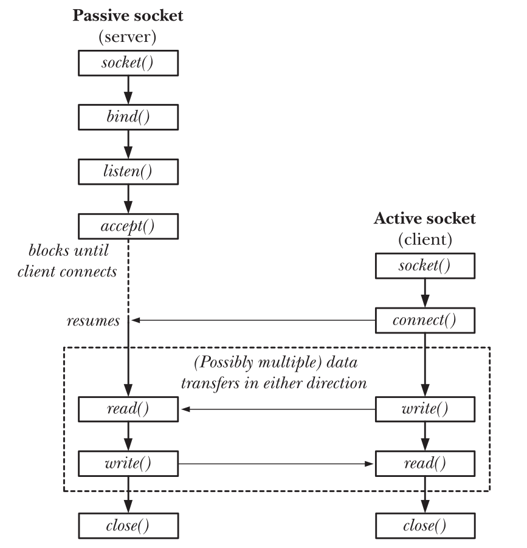
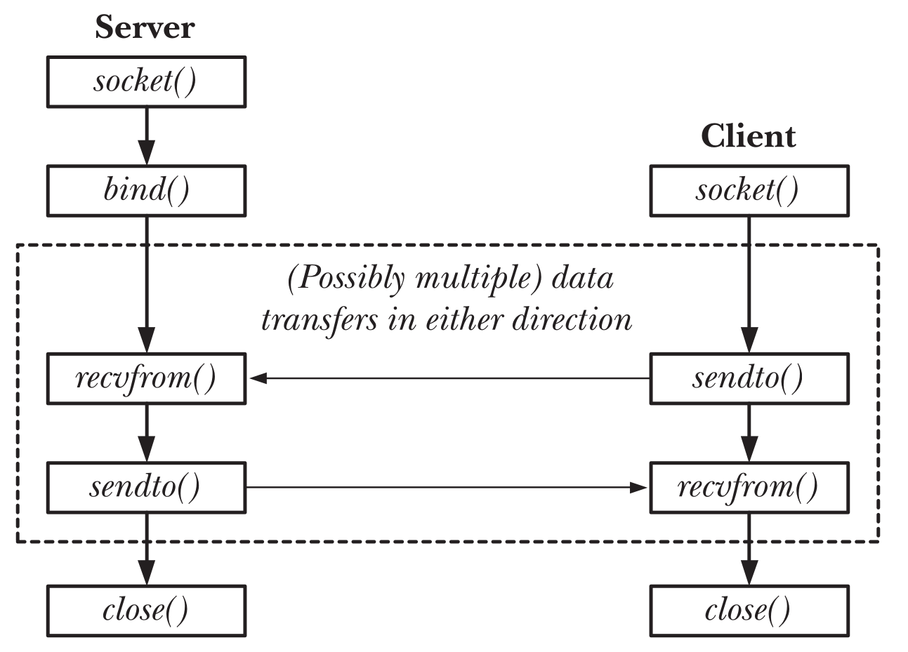

# Introduction

Sockets are a method of IPC that allow data to be exchanged between applications,  
either on the same host (computer) or on different hosts connected by a network.

## **1\. CREATING A SOCKET**

*BOTH SERVER AND CLIENT USES THIS*

```
#include <sys/socket.h>
int socket(int domain, int type, int protocol);
//Returns file descriptor on success, or –1 on error
```

- Domain can be one of **AF_UNIX, AF_INET, AF_INET6**.
- Type can be either **SOCK_STREAM** for *TCP* or **SOCK_DGRAM** for *UDP*
- Protocol can be 0,

|     |     |     |     |     |
| --- | --- | --- | --- | --- |
| **<span style="color: #000000;">Domain</span>** | **<span style="color: #000000;">Communication</span> <span style="color: #000000;">performed</span>** | **<span style="color: #000000;">Communication</span> <span style="color: #000000;">between applications</span>** | **<span style="color: #000000;">Address format</span>** | **<span style="color: #000000;">Address</span> <span style="color: #000000;">structure</span>** |
| <span style="color: #000000;">AF_UNIX</span> | <span style="color: #000000;">within kernel</span> | <span style="color: #000000;">on same host</span> | <span style="color: #000000;">path name</span> | <span style="color: #000000;">sockaddr_un</span> |
| <span style="color: #000000;">AF_INET</span> | <span style="color: #000000;">via IPv4</span> | <span style="color: #000000;">on hosts connected</span>  <br><br/><span style="color: #000000;">via an IPv4 network</span> | <span style="color: #000000;">32-bit IPv4 address +</span>  <br><br/><span style="color: #000000;">16-bit port number</span> | <span style="color: #000000;">sockaddr_in</span> |
| <span style="color: #000000;">AF_INET6</span> | <span style="color: #000000;">via IPv6</span> | <span style="color: #000000;">on hosts connected</span>  <br><br/><span style="color: #000000;">via an IPv6 network</span> | <span style="color: #000000;">128-bit IPv6 address +</span>  <br><br/><span style="color: #000000;">16-bit port number</span> | <span style="color: #000000;">sockaddr_in6</span> |

&nbsp;

## **2\. BINDING A SOCKET WITH A SPECIFIC ADDRESS** (which is used by clients to send connection requests)

*SERVER EXCLUSIVE SYSCALL*

```
#include <sys/socket.h>
int bind(int sockfd, const struct sockaddr *addr, socklen_t addrlen);
//Returns 0 on success, or –1 on error
```

- Here the sockfd is the server’s socket file descriptor created using the socket syscall.
- Addr is the address of the structure sockaddr_in(or sockaddr_in6 or sockaddr_un), in which the sa_family, address and the port numbers are stored.  
    Here are the actual structures of all the 3 sockaddr_family

This is the generic sockaddr structure, this is just used for typecasting. We don't create any address with this

```
struct sockaddr {
sa_family_t sa_family;			/* Address family (AF_* constant) */
Char sa_data[14];			/* Socket address (size varies according to socket domain) */
};

```

and these are the actual structs of the sockaddr_un, sockaddr_in, and sockaddr_in6,

```
struct sockaddr_un {
sa_family_t sun_family;			/* Always AF_UNIX */
char sun_path[108];			/* Null-terminated socket pathname */
};
```

```
struct in_addr {			/* IPv4 4-byte address */
in_addr_t s_addr;			/* Unsigned 32-bit integer */
};

struct sockaddr_in {			/* IPv4 socket address */
sa_family_t sin_family;			/* Address family (AF_INET) */
in_port_t sin_port;			/* Port number */		
struct in_addr sin_addr;		/* IPv4 address */
unsigned char __pad[X];			/* Pad to size of 'sockaddr' structure (16 bytes) */
};
```

```
struct in6_addr {			/* IPv6 address structure */
uint8_t s6_addr[16];			/* 16 bytes == 128 bits */
};

struct sockaddr_in6 {			/* IPv6 socket address */
sa_family_t sin6_family;		/* Address family (AF_INET6) */
in_port_t sin6_port;			/* Port number */
uint32_t sin6_flowinfo;			/* IPv6 flow information */
struct in6_addr sin6_addr;		/* IPv6 address */
uint32_t sin6_scope_id;			/* Scope ID (new in kernel 2.4) */
};
```

## **3.MAKING THE SOCKET LISTEN FOR CONNECTIONS**

*SERVER EXCLUSIVE SYSCALL*

```
#include <sys/socket.h>
int listen(int sockfd, int backlog);
//Returns 0 on success, or –1 on error
```

- Backlog is the max number of connections that are allowed for pending

## **4.ACCEPTING THE CONNECTIONS**

*SERVER EXCLUSIVE SYSCALL*

```
#include <sys/socket.h>
int accept(int sockfd, struct sockaddr *addr, socklen_t *addrlen);
//Returns file descriptor on success, or –1 on error
```

- Notice that here we have socklen_t \* addrlen which is a pointer to the address length, not the length itself. Here the addr refers to the client address who we want to connect to.
    
- We create a struct sockaddr_family for the sake of the client and fill the addr with the client's address after successful acceptance. And the addrlen stores the client’s address size.
    

## **5.CONNECTING TO THE SERVER.**

*CLIENT EXCLUSIVE SYSCALL*

```
#include <sys/socket.h>
int connect(int sockfd, const struct sockaddr *addr, socklen_t addrlen);
//Returns 0 on success, or –1 on error
```

- Now here the ***sockfd*** refers to the clients sockfd and The ***addr*** refers to servers’s address and addrlen also of the server .the information to connect to the server is predefined in the client or taken through user input.

## I/O on stream sockets:
A pair of connected stream sockets provides a bidirectional communication chan-
nel between the two endpoints
- To perform I/O, we use the read() and write() system calls (or the socket-specific
send() and recv().
- The usual way of terminating a stream socket connection is to call close().

****

&nbsp;

## I/O on Datagram sockets:
**These are used to send and receive data:**



```
ssize_t recvfrom(int sockfd, void *buffer, size_t length, int flags,
struct sockaddr *src_addr, socklen_t *addrlen);
//Returns number of bytes received, 0 on EOF, or –1 on error
```

```
ssize_t sendto(int sockfd, const void *buffer, size_t length, int flags,
const struct sockaddr *dest_addr, socklen_t addrlen);
//Returns number of bytes sent, or –1 on error
```

Socket I/O can also be implemented using

- read()
- write()
- send()
- recv()
- fcntl()